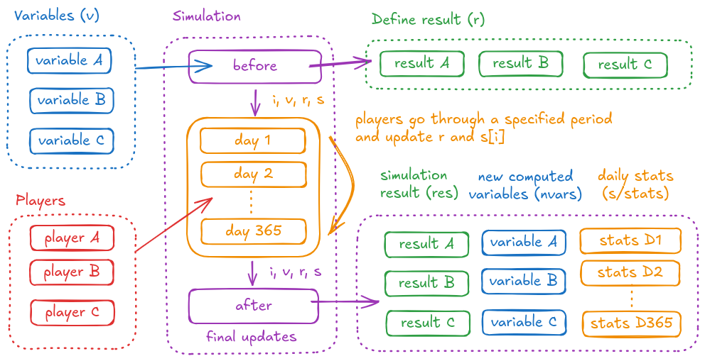
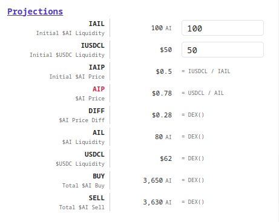
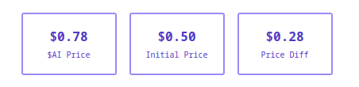
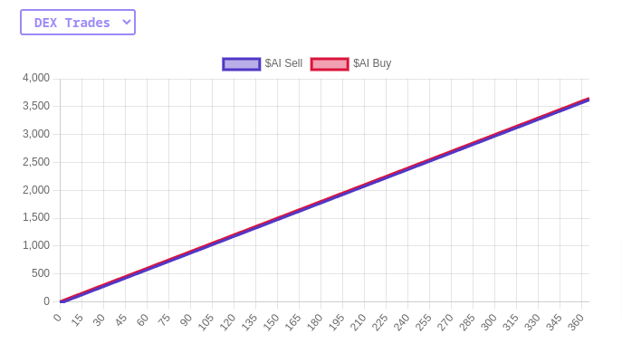
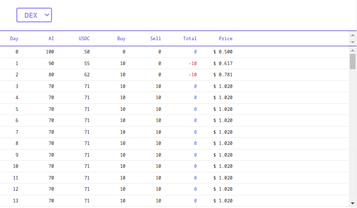

# AI3 - AI Owned Tokenomics Framework

<div align="center"></div>

```bash
yarn add ai3
```

## Quick Guide

We will define simple configurations in `token.js` and create a test in `test.js`.

```bash
mkdir myai3 && cd myai3 && yarn init && yarn add ai3
touch token.js test.js
```

This is the overview of how the simulation works.

<div align="center"></div>

### Variables

Define various variables for the protocol and the market in `token.js`.

Let's simulate a dex pair with $AI and $USDC.

```js
export const vars = {
  iail: { name: "Initial $AI Liquidity", val: 100 },
  iusdcl: { name: "Initial $USDC Liquidity", val: 50 },
  iaip: { name: "Initial $AI Price", val: g => g("iusdcl") / g("iail") },
  ail: { name: "$AI Liquidity", val: (g, r) => r.ai },
  usdcl: { name: "$USDC Liquidity", val: (g, r) => r.usdc },
  aip: { name: "$AI Price", val: (g, r) => r.usdc / r.ai },
  buy: { name: "Total $AI Buy", val: (g, r) => r.total_buy },
  sell: { name: "Total $AI Sell", val: (g, r) => r.total_sell },
}
```

`val` can be either a number or a function to calculate a number from other variables and the simulation result.

- `g` : getter function to get a variable
- `r` : result from the simulation

For example, the initial $AI price (`iaip`) is computed by `g("iusdcl") / g("iail")`, and the current $AI price (`aip`) is computed by `r.usdc / r.ai` from the simulation result `r`.

### Before / After

In `before`, define intermediate variables that should be tracked during the simulation and returned as the final result.

`after` can do final cleanups after the simulation is complete.

```js
export const before = ({ v }) => {
  return {
    price: v.iusdcl / v.iail,
    ai: v.iail,
    usdc: v.iusdcl,
    total_buy: 0,
    total_sell: 0,
  }
}

export const after = ({ i, v, r, s }) => {
  r.diff = r.price - s[0].price // recording the $AI price difference
}
```
- `v` : computed vars (immutable)

### Players

The simulations will loop through a specified period of time and any logic to change the variables is injectable as players.

```js
const buyer = {
  key: "BUYER",
  desc: "Buyer buys 10 $AI if the price is less than $1.",
  fn: ({ i, v, r, s }) => {
    if (r.price < 1) {
      const ai = r.ai - 10
      const usdc = (r.usdc * r.ai) / ai
      r.ai = ai
      r.usdc = usdc
      r.price = usdc / ai
      r.total_buy += 10
      s[i].buy = 10
    }
  },
}

const seller = {
  key: "SELLER",
  desc: "Seller sells 7 $AI if the price is more than $1.",
  fn: ({ i, v, r, s }) => {
    if (r.price > 1) {
      const ai = r.ai + 7
      const usdc = (r.usdc * r.ai) / ai
      r.ai = ai
      r.usdc = usdc
      r.price = usdc / ai
      r.total_sell += 7
      s[i].sell = 7
    }
  },
}

export const players = [buyer, seller]
```

- `i` : days from the beggining
- `v` : computed vars (immutable)
- `r` : simulation result
- `s` : daily stats

`r` is the final simulation result to be returned. `s` is an array of daily stats. All the variables in `r` is automatically copied to `s` as daily records. Players should update `r` and `s[i]` to record their action.

In the example above, daily `buy` and `sell` are recorded in `s[i]` as well as all the daily state of `r` variables (`price`, `ai`, `usdc`, `total_buy`, `total_sell`).

### Simulate

Let's write a simulation test in `test.js`.

```js
import assert from "assert"
import { describe, it } from "node:test"
import { AI3 } from "ai3"
import { vars, before, after, players } from "./token.js"

describe("AI3", () => {
  it("should simulate", async () => {
    const ai3 = new AI3({ vars })
    const { nvars, res, stats } = ai3.simulate({
      before,
      after,
      players,
      years: 1,
    })
    assert.equal(nvars.ail, 71) // nvars = new computed variables
    assert.equal(ai3.get("ail"), 71) // get a single variable
  })
})
```

- `nvars` : new computed variables with the simulation result
- `res` : simulation result
- `stats` : daily stats

Add `"type": "module"` to `package.json` so we can test with ES6.

```json
{
  "type": "module",
  "dependencies": {
    "ai3": "^0.0.2"
  }
}
```

Run the simulation.

```bash
node test.js
```

### Dashboard

4 components can be customized in the dashboard app. Add each configuration in `token.js`.

#### Variable Columns

<div align="center"></div>

```js
export const cols = [
  [
    {
      title: "Projections",
      vals: "iail,iusdcl,iaip,aip,diff,ail,usdcl,buy,sell",
    },
  ],
]
```

The displayed data formats and descriptions can be added to the `vars`.

```js
export const vars = {
  iail: { name: "Initial $AI Liquidity", val: 100, type: "AI" },
  iusdcl: { name: "Initial $USDC Liquidity", val: 50, decimal: 0 },
  iaip: {
    name: "Initial $AI Price",
    val: g => g("iusdcl") / g("iail"),
    calc: "IUSDCL / IAIL",
  },
  ail: {
    name: "$AI Liquidity",
    val: (g, r) => r.ai,
    type: "AI",
    calc: "DEX()",
  },
  usdcl: {
    name: "$USDC Liquidity",
    val: (g, r) => r.usdc,
    decimal: 0,
    calc: "DEX()",
  },
  aip: {
    name: "$AI Price",
    val: (g, r) => r.usdc / r.ai,
    color: "crimson",
    calc: "USDCL / AIL",
  },
  buy: {
    name: "Total $AI Buy",
    val: (g, r) => r.total_buy,
    type: "AI",
    calc: "DEX()",
  },
  sell: {
    name: "Total $AI Sell",
    val: (g, r) => r.total_sell,
    type: "AI",
    calc: "DEX()",
  },
  diff: {
    name: "$AI Price Diff",
    val: (g, r) => r.diff,
    calc: "DEX()",
  },
}
```
#### Top Stats

<div align="center"></div>

```js
export const stats = g => [
  {
    title: "$AI Price",
    val: `$${(Math.floor(g("aip") * 100) / 100).toFixed(2)}`,
  },
  {
    title: "Initial Price",
    val: `$${(Math.floor(g("iaip") * 100) / 100).toFixed(2)}`,
  },
  {
    title: "Price Diff",
    val: `$${(Math.floor(g("diff") * 100) / 100).toFixed(2)}`,
  },
]
```

#### Line Graphs

<div align="center"></div>

```js
export const graphs = [
  {
    key: "price",
    name: "$AI Price",
    span: 7,
    lines: [{ label: "$AI Price", key: "price", floor: false }],
  },
  {
    key: "dex",
    name: "DEX Trades",
    lines: [
      { label: "$AI Sell", key: "total_sell" },
      { label: "$AI Buy", key: "total_buy", color: "#DC143C" },
    ],
  },
]
```

#### Stats Tables

<div align="center"></div>

```js
export const table = [
  {
    key: "dex",
    name: "DEX",
    cols: [
      { title: "Day", w: "40px", val: "i" },
      { title: "AI", val: "ai" },
      { title: "USDC", val: "usdc" },
      { title: "Buy", val: s => s.buy ?? 0 },
      { title: "Sell", val: s => s.sell ?? 0 },
      {
        title: "Total",
        val: s => (s.sell ?? 0) - (s.buy ?? 0),
        color: val => (val < 0 ? "crimson" : "royalblue"),
      },
      { title: "Price", val: v => `$ ${v.price.toFixed(3)}` },
    ],
  },
]

```

#### Run Dashboard App

Clone this repo and install dependencies.

```bash
git clone https://github.com/weavedb/ai3.git
cd ai3/dashboard && yarn
```

Replace the `lib/token/index.js` file with the `token.js` created earlier, then run the app.

```bash
yarn dev
```

Now the dashboard is running at [localhost:3000](http://localhost:3000).

## Advanced

### Finding The Best Parameters

You can design the best tokenomics by fuzz testing your simulation logic.

Let's find out the best initial USDC liquidity within the range of $10 and $100 to maximize the $AI token price in a year.

```js
import assert from "assert"
import { afterEach, describe, it, beforeEach } from "node:test"
import { AI3 } from "ai3"
import { vars, before, after, players } from "./token.js"
import { clone } from "ramda"

describe("AI3", () => {
  it("should find the best iusdcl", async () => {
    let max = null
    for (let i = 10; i <= 100; i++) {
      let _vars = clone(vars)
      _vars.iusdcl.val = i
      const ai3 = new AI3({ vars: _vars })
      const { nvars, res, stats } = ai3.simulate({
        before,
        after,
        players,
        years: 1,
      })
      if (!max || max.aip < nvars.aip) {
        max = { iusdcl: _vars.iusdcl.val, aip: nvars.aip, res }
      }
    }
    assert.equal(max.iusdcl, 25)
    assert.equal(Math.floor(max.aip * 100) / 100, 1.13)
  })
})

```

Now we know `$25` is the best initial USDC liquidity, which increases the $AI price to around `$1.13`.

### Plugins

AI3 plugins help building complex variables and highly intelligent players.

Coming soon...

### Integrating AI Agents

You can inject AI agents as players and explore the best strategies.

Coming soon...

### Protocol Owned AI Agents

In the same way, you can create AI agents that have superuser access to change protocol parameters and let them play against other players to design unbreakable tokenomics.

Coming soon...
